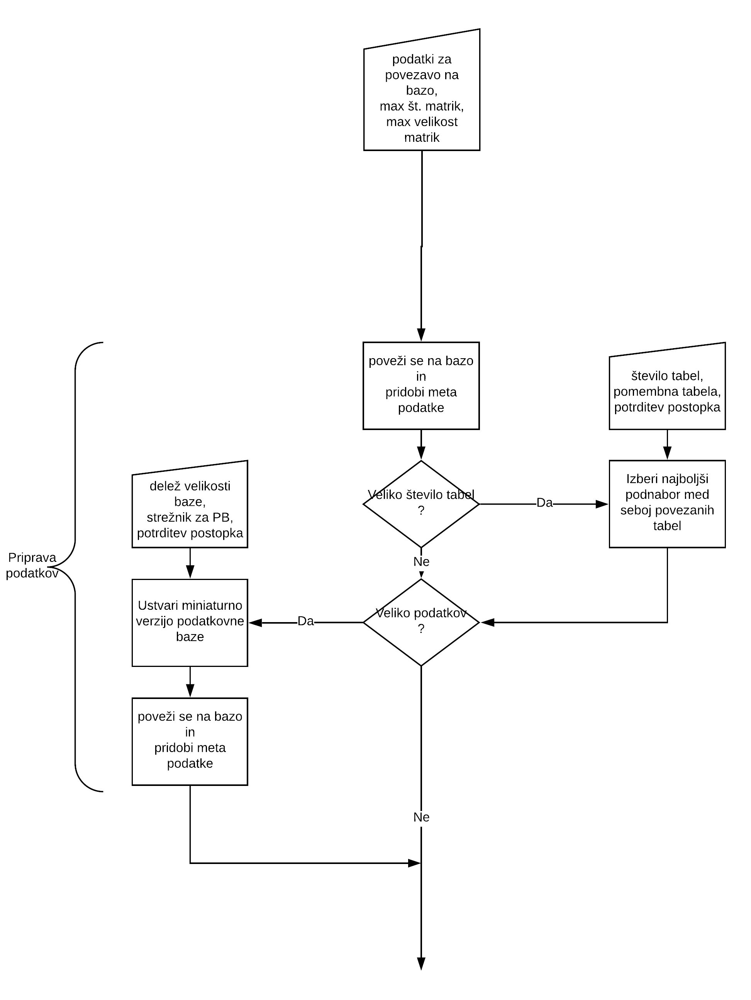
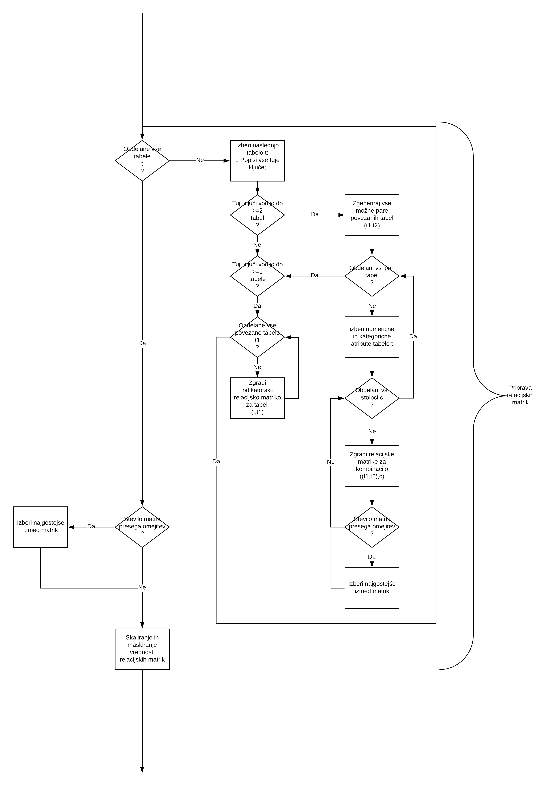
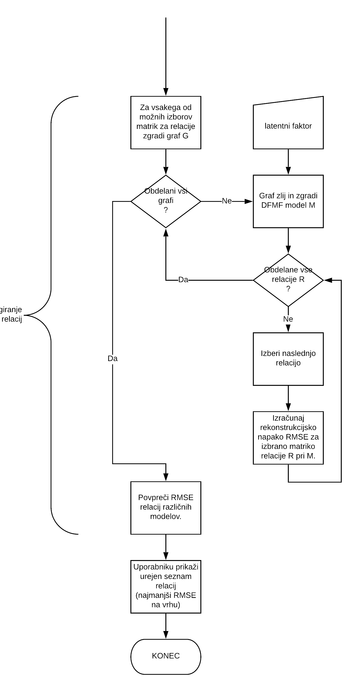

# DB Relation Ranking Tool
--------------------------------
Orodje je namenjeno merjenju stopnje povezanosti med pari tabel v relacijskih podatkovnih bazah (postgresql).
Metrika, ki se zato uporablja, je kvaliteta prileganja modela DFMF (Data Fusion Matrix Factorization) matricnemu opisu relacij med tabelami.

Postopek lahko v grobem razdelimo na tri glavne korake:
* priprava podatkov,
* gradnja relacijskih matrik,
* ocenjevanje relacij.

## Priprava podatkov

## Gradnja relacijskih matrik

## Ocenjevanje relacij
